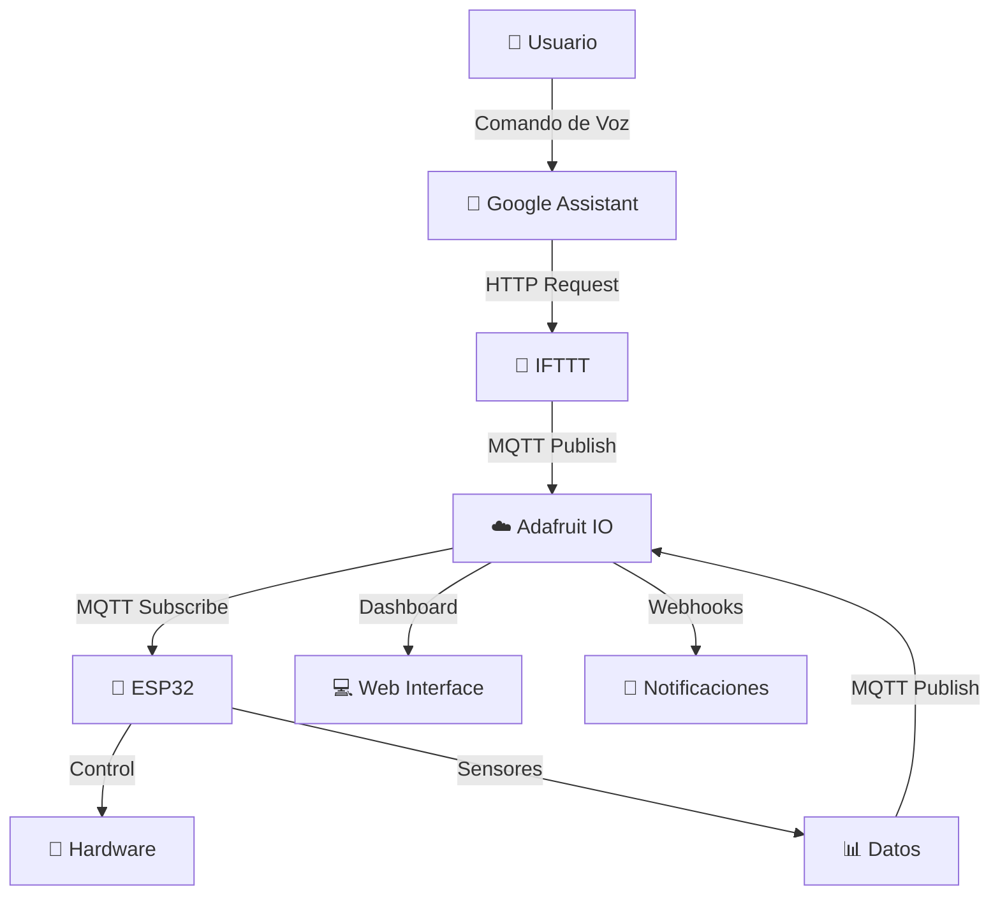
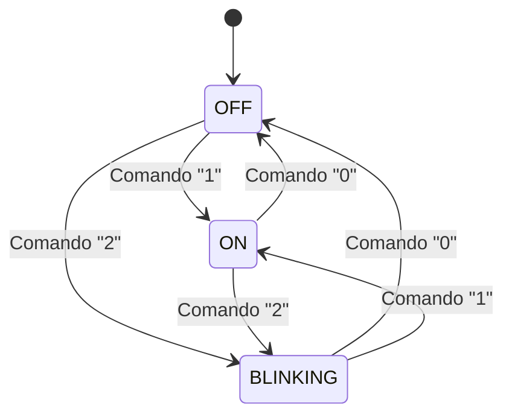
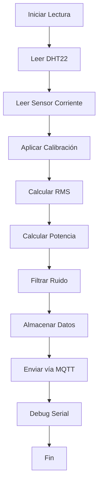
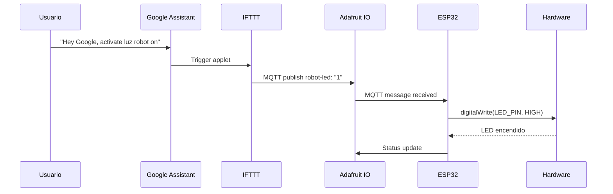

# 🎤 Sistema IoT de Control por Voz - ESP32

[](https://www.espressif.com/en/products/socs/esp32)
[](https://io.adafruit.com/)
[](https://assistant.google.com/)
[](https://ifttt.com/)

> Sistema completo de automatización IoT que permite controlar dispositivos robóticos y monitorear sensores ambientales mediante comandos de voz usando Google Assistant.

## 📋 Tabla de Contenidos

- [Características](#-características)
- [Arquitectura del Sistema](#-arquitectura-del-sistema)
- [Hardware Requerido](#-hardware-requerido)
- [Instalación](#-instalación)
- [Configuración](#-configuración)
- [Comandos de Voz](#-comandos-de-voz)
- [Estructura del Código](#-estructura-del-código)
- [Diagramas](#-diagramas)
- [API y Endpoints](#-api-y-endpoints)
- [Troubleshooting](#-troubleshooting)
- [Contribuciones](#-contribuciones)
- [Licencia](#-licencia)

## 🚀 Características

### Control por Voz
- ✅ Control de LED (ON/OFF/Parpadeo)
- ✅ Movimiento de cámara robótica (8 direcciones)
- ✅ Consulta de sensores en tiempo real
- ✅ Comandos en español via Google Assistant

### Monitoreo de Sensores
- 🌡️ **Temperatura** - Sensor DHT22 (±0.5°C)
- 💧 **Humedad** - Sensor DHT22 (±2%)
- ⚡ **Corriente AC** - Sensor SCT013-100A con calibración automática
- 🔋 **Potencia** - Cálculo en tiempo real (P = I × V)

### Conectividad
- 📡 **WiFi** - Conexión inalámbrica principal
- 📱 **Bluetooth** - Control de respaldo
- ☁️ **MQTT** - Comunicación bidireccional con Adafruit IO
- 🌐 **Webhooks** - Notificaciones push

### Características Técnicas
- 🔄 **Reconexión automática** WiFi y MQTT
- 📊 **Dashboard web** tiempo real
- 🔔 **Notificaciones push** automáticas
- 🛠️ **Calibración automática** sensores
- 📱 **Control manual** via dashboard

## 🏗️ Arquitectura del Sistema



### Flujo de Datos

1. **Entrada**: Comando de voz → Google Assistant
2. **Procesamiento**: IFTTT → Adafruit IO (MQTT Broker)
3. **Ejecución**: ESP32 → Actuadores/Sensores
4. **Respuesta**: Datos → Dashboard/Notificaciones

## 🔧 Hardware Requerido

### Componentes Principales
| Componente | Modelo | Cantidad | Función |
|------------|--------|----------|---------|
| Microcontrolador | ESP32 DevKit V1 | 1 | Control principal |
| Sensor T/H | DHT22 | 1 | Temperatura y humedad |
| Sensor Corriente | SCT013-100A | 1 | Medición corriente AC |
| Servomotores | SG90 | 2 | Movimiento cámara |
| LED | 5mm | 1 | Indicador visual |
| Resistencias | 10kΩ, 22Ω | 2 | Pull-up y burden |

### Diagrama de Conexiones

```
ESP32 DevKit V1
├── Pin 4   → DHT22 (Datos) + Resistencia 10kΩ pull-up
├── Pin 12  → LED (Ánodo) + Resistencia 330Ω
├── Pin 17  → Servomotor Pan (PWM - Señal)
├── Pin 18  → Servomotor Tilt (PWM - Señal)
├── Pin 32  → SCT013-100A (Analógico) + Resistencia 22Ω burden
├── GND     → Tierra común todos los componentes
├── 3V3     → DHT22 (VCC)
└── 5V      → Servomotores (VCC)
```

## 📦 Instalación

### 1. Preparar Entorno de Desarrollo

```bash
# Instalar Arduino IDE
# Agregar URL del ESP32 en File > Preferences > Additional Board Manager URLs:
https://dl.espressif.com/dl/package_esp32_index.json

# Instalar Board ESP32 en Tools > Board > Boards Manager
```

### 2. Instalar Librerías Requeridas

```bash
# En Arduino IDE: Tools > Manage Libraries
# Instalar las siguientes librerías:
```

| Librería | Versión | Función |
|----------|---------|---------|
| `WiFi` | Built-in | Conectividad WiFi |
| `PubSubClient` | 2.8+ | Cliente MQTT |
| `ArduinoJson` | 6.21+ | Manejo de JSON |
| `DHT sensor library` | 1.4+ | Sensor DHT22 |
| `ESP32Servo` | 0.13+ | Control servomotores |
| `BluetoothSerial` | Built-in | Comunicación Bluetooth |
| `HTTPClient` | Built-in | Requests HTTP |

### 3. Clonar Repositorio

```bash
git clone https://github.com/tuusuario/esp32-voice-control-iot.git
cd esp32-voice-control-iot
```

## ⚙️ Configuración

### 1. Configuración del Código

Edita las siguientes líneas en `esp32_voice_control.ino`:

```cpp
// ===== CONFIGURACIÓN DE RED =====
const char* ssid = "TU_WIFI_SSID";          // 📡 Cambiar por tu WiFi
const char* password = "TU_WIFI_PASSWORD";   // 🔐 Cambiar por tu contraseña

// ===== CONFIGURACIÓN ADAFRUIT IO =====
#define AIO_USERNAME    "TU_USUARIO"         // 👤 Tu username de Adafruit IO
#define AIO_KEY         "TU_AIO_KEY"         // 🔑 Tu AIO Key

// ===== CONFIGURACIÓN WEBHOOKS IFTTT =====
#define IFTTT_WEBHOOK_KEY "TU_WEBHOOK_KEY"   // 🪝 Tu Webhook Key de IFTTT
```

### 2. Configuración de Adafruit IO

1. Crear cuenta en [io.adafruit.com](https://io.adafruit.com)
2. Crear los siguientes feeds:

| Feed Name | Descripción | Tipo |
|-----------|-------------|------|
| `robot-led` | Control LED | Comando |
| `robot-servo-pan` | Servo horizontal | Comando |
| `robot-servo-tilt` | Servo vertical | Comando |
| `robot-command` | Comandos complejos | Comando |
| `robot-temperature` | Temperatura | Sensor |
| `robot-humidity` | Humedad | Sensor |
| `robot-current` | Corriente | Sensor |
| `robot-power` | Potencia | Sensor |
| `robot-status` | Estado sistema | Estado |

### 3. Configuración de IFTTT

1. Crear cuenta en [ifttt.com](https://ifttt.com)
2. Conectar Google Assistant y Adafruit
3. Crear applets según la tabla de [Comandos de Voz](#-comandos-de-voz)

## 🎤 Comandos de Voz

### Comandos de Control

| Comando | Acción | Feed | Valor |
|---------|--------|------|-------|
| "Hey Google, activate luz robot on" | Encender LED | robot-led | 1 |
| "Hey Google, activate luz robot off" | Apagar LED | robot-led | 0 |
| "Hey Google, activate luz robot blink" | Parpadear LED | robot-led | 2 |
| "Hey Google, activate camera center" | Centrar cámara | robot-command | center |
| "Hey Google, activate camera up" | Inclinar arriba | robot-command | up |
| "Hey Google, activate camera down" | Inclinar abajo | robot-command | down |
| "Hey Google, activate camera left" | Girar izquierda | robot-command | left |
| "Hey Google, activate camera right" | Girar derecha | robot-command | right |

### Comandos de Consulta

| Comando | Respuesta | Webhook |
|---------|-----------|---------|
| "Hey Google, activate temperatura robot" | Notificación con temperatura actual | temperatura_robot |
| "Hey Google, activate humedad robot" | Notificación con humedad actual | humedad_robot |
| "Hey Google, activate consumo robot" | Notificación con corriente y potencia | consumo_robot |
| "Hey Google, activate estado robot" | Notificación con todos los datos | estado_robot |

## 📁 Estructura del Código

### Archivo Principal: `esp32_voice_control.ino`

```cpp
// ===== SECCIÓN 1: INCLUDES Y CONFIGURACIÓN =====
#include <WiFi.h>           // WiFi
#include <PubSubClient.h>   // MQTT
#include <ArduinoJson.h>    // JSON
#include <DHT.h>            // Sensor DHT22
#include <ESP32Servo.h>     // Servomotores
#include <BluetoothSerial.h> // Bluetooth
#include <HTTPClient.h>     // HTTP requests

// ===== SECCIÓN 2: DEFINICIONES Y CONSTANTES =====
#define DHT_PIN 4           // Pin del DHT22
#define LED_PIN 12          // Pin del LED
#define SERVO_PAN_PIN 17    // Pin servo horizontal
#define SERVO_TILT_PIN 18   // Pin servo vertical
#define CURRENT_SENSOR_PIN 32 // Pin sensor corriente

// ===== SECCIÓN 3: OBJETOS GLOBALES =====
DHT dht(DHT_PIN, DHT_TYPE);
Servo servoPan, servoTilt;
WiFiClient espClient;
PubSubClient client(espClient);
BluetoothSerial SerialBT;

// ===== SECCIÓN 4: ESTRUCTURA DE DATOS =====
struct SensorData {
  float temperature;    // Temperatura en °C
  float humidity;       // Humedad en %
  float current;        // Corriente en A
  float power;          // Potencia en W
  int panPosition;      // Posición servo pan (0-180°)
  int tiltPosition;     // Posición servo tilt (0-180°)
  int ledState;         // Estado LED (0=OFF, 1=ON, 2=BLINK)
};
```

### Funciones Principales

#### `setup()`
```cpp
void setup() {
  // 1. Inicializar hardware (sensores, servos, LED)
  // 2. Calibrar sensor de corriente
  // 3. Conectar WiFi
  // 4. Conectar Adafruit IO (MQTT)
  // 5. Inicializar Bluetooth
  // 6. Configurar ADC
}
```

#### `loop()`
```cpp
void loop() {
  // 1. Mantener conexión MQTT
  // 2. Leer sensores cada 5s
  // 3. Enviar datos cada 10s
  // 4. Procesar comandos MQTT
  // 5. Manejar LED parpadeante
  // 6. Procesar comandos Bluetooth
}
```

#### Funciones de Hardware
```cpp
void initializeHardware()     // Inicializar pins y sensores
void calibrateCurrentSensor() // Calibrar sensor corriente automáticamente
void readSensors()            // Leer todos los sensores
```

#### Funciones de Comunicación
```cpp
void connectWiFi()            // Conectar a WiFi con retry
void connectToAdafruitIO()    // Conectar MQTT con autenticación
void adafruitCallback()       // Procesar comandos MQTT recibidos
void sendDataToAdafruitIO()   // Enviar datos de sensores
void sendWebhookNotification() // Enviar webhook a IFTTT
```

#### Funciones de Control
```cpp
void handleComplexCommand()   // Procesar comandos complejos
void handleLedBlinking()      // Controlar LED parpadeante
void handleBluetoothCommands() // Procesar comandos Bluetooth
```

## 📊 Diagramas

### Diagrama de Estados - LED



### Diagrama de Flujo - Sensores



### Arquitectura de Comunicación



## 🔌 API y Endpoints

### MQTT Topics (Adafruit IO)

#### Topics de Comando (Subscribe)
```
username/feeds/robot-led          // Control LED: 0|1|2
username/feeds/robot-servo-pan    // Servo Pan: 0-180
username/feeds/robot-servo-tilt   // Servo Tilt: 0-180
username/feeds/robot-command      // Comandos: center|up|down|left|right|temperatura|humedad|consumo|estado
```

#### Topics de Datos (Publish)
```
username/feeds/robot-temperature  // Temperatura: float
username/feeds/robot-humidity     // Humedad: float
username/feeds/robot-current      // Corriente: float
username/feeds/robot-power        // Potencia: float
username/feeds/robot-status       // Estado: string
```

### Webhooks IFTTT

#### URLs de Webhook
```
http://maker.ifttt.com/trigger/{evento}_robot/with/key/{WEBHOOK_KEY}
```

#### Eventos Disponibles
- `temperatura_robot` - Consulta temperatura
- `humedad_robot` - Consulta humedad
- `consumo_robot` - Consulta corriente/potencia
- `estado_robot` - Consulta estado completo

#### Payload JSON
```json
{
  "value1": "23.5",           // Valor principal
  "value2": "192.168.1.100",  // IP del ESP32
  "value3": "2024-01-15"      // Timestamp
}
```

### Comandos Bluetooth

#### Formato de Comandos
```
LED:1           // Encender LED
LED:0           // Apagar LED
LED:2           // Parpadear LED
SERVO:PAN:90    // Mover servo pan a 90°
SERVO:TILT:45   // Mover servo tilt a 45°
STATUS          // Obtener estado
CALIBRATE       // Recalibrar sensor corriente
```

#### Respuesta de Estado
```
T:23.5,H:45.2,I:0.123,P:27.06,PAN:90,TILT:90,LED:1
```

## 🔧 Troubleshooting

### Problemas Comunes

#### ❌ ESP32 no conecta a WiFi
```cpp
// Verificar en Serial Monitor:
Serial.println("WiFi SSID: " + String(ssid));
Serial.println("WiFi Status: " + String(WiFi.status()));

// Soluciones:
// 1. Verificar SSID y contraseña
// 2. Verificar que WiFi sea 2.4GHz (no 5GHz)
// 3. Reiniciar router si es necesario
```

#### ❌ No se conecta a Adafruit IO
```cpp
// Verificar en Serial Monitor:
Serial.println("MQTT State: " + String(client.state()));

// Códigos de error MQTT:
// -4: Timeout de conexión
// -3: Conexión perdida
// -2: Conexión rechazada
// -1: Desconectado
//  1: Protocolo incorrecto
//  2: ID rechazado
//  3: Servidor no disponible
//  4: Credenciales incorrectas
//  5: No autorizado
```

#### ❌ Google Assistant no responde
```cpp
// Verificaciones:
// 1. IFTTT applet está "ON"
// 2. Google Assistant conectado en IFTTT
// 3. Adafruit conectado en IFTTT
// 4. Usar comando exacto: "Hey Google, activate [scene name]"
// 5. Idioma en español en Google Assistant
```

#### ❌ Sensor de corriente muestra valores incorrectos
```cpp
// Soluciones:
// 1. Ejecutar calibración: enviar "CALIBRATE" por Bluetooth
// 2. Verificar que no haya carga durante calibración
// 3. Ajustar CURRENT_CALIBRATION en código
// 4. Verificar conexión del sensor
```

#### ❌ Servos no se mueven
```cpp
// Verificaciones:
// 1. Alimentación 5V para servos
// 2. Conexión correcta de pines PWM
// 3. Verificar en Serial Monitor si recibe comandos
// 4. Probar control manual desde dashboard
```

### Debug del Sistema

#### Habilitar Debug Detallado
```cpp
// Agregar al inicio del loop():
#define DEBUG_VERBOSE 1

#if DEBUG_VERBOSE
  Serial.println("=== DEBUG INFO ===");
  Serial.println("WiFi: " + String(WiFi.status()));
  Serial.println("MQTT: " + String(client.connected()));
  Serial.println("Free Heap: " + String(ESP.getFreeHeap()));
  Serial.println("Uptime: " + String(millis()));
#endif
```

#### Monitor Serial Típico
```
=== SISTEMA IOT INICIADO ===
✅ Hardware inicializado correctamente
⚡ Calibrando sensor de corriente...
✅ Sensor calibrado - Offset: 1.60V
📶 Conectando a WiFi....
✅ WiFi conectado!
📍 IP: 192.168.1.100
🔌 Conectando a Adafruit IO (1/5)... ✅ Conectado!
📡 Suscrito a feeds de comandos
📋 Estado enviado a Adafruit IO
📊 T:23.5°C H:45.2% I:0.123A P:27.06W
📤 Datos enviados a Adafruit IO
🎙️ Comando de voz recibido [robot-led]: 1
💡 LED: ON
```

## 🤝 Contribuciones

### Cómo Contribuir

1. **Fork** el repositorio
2. **Crear** una rama para tu feature (`git checkout -b feature/nueva-funcionalidad`)
3. **Commit** tus cambios (`git commit -am 'Agregar nueva funcionalidad'`)
4. **Push** a la rama (`git push origin feature/nueva-funcionalidad`)
5. **Crear** un Pull Request

### Ideas de Mejoras

- [ ] **Cámara ESP32-CAM** - Streaming de video
- [ ] **Sensor PIR** - Detección de movimiento
- [ ] **Sensor ultrasónico** - Medición de distancia
- [ ] **Control de relés** - Dispositivos de 220V
- [ ] **Pantalla OLED** - Display local
- [ ] **Sensor de gas** - Calidad del aire
- [ ] **GPS** - Geolocalización
- [ ] **LoRa** - Comunicación de largo alcance

### Estilo de Código

```cpp
// Usar camelCase para variables
int temperatureValue = 25;

// Usar UPPER_CASE para constantes
#define MAX_TEMPERATURE 50

// Comentarios descriptivos
// ===== SECCIÓN: DESCRIPCIÓN =====

// Funciones con nombres descriptivos
void initializeTemperatureSensor() {
  // Código aquí
}
```

## 📄 Licencia

Este proyecto está bajo la Licencia MIT - ver el archivo [LICENSE](LICENSE) para detalles.

```
MIT License

Copyright (c) 2024 [Tu Nombre]

Permission is hereby granted, free of charge, to any person obtaining a copy
of this software and associated documentation files (the "Software"), to deal
in the Software without restriction, including without limitation the rights
to use, copy, modify, merge, publish, distribute, sublicense, and/or sell
copies of the Software, and to permit persons to whom the Software is
furnished to do so, subject to the following conditions:

The above copyright notice and this permission notice shall be included in all
copies or substantial portions of the Software.

THE SOFTWARE IS PROVIDED "AS IS", WITHOUT WARRANTY OF ANY KIND, EXPRESS OR
IMPLIED, INCLUDING BUT NOT LIMITED TO THE WARRANTIES OF MERCHANTABILITY,
FITNESS FOR A PARTICULAR PURPOSE AND NONINFRINGEMENT. IN NO EVENT SHALL THE
AUTHORS OR COPYRIGHT HOLDERS BE LIABLE FOR ANY CLAIM, DAMAGES OR OTHER
LIABILITY, WHETHER IN AN ACTION OF CONTRACT, TORT OR OTHERWISE, ARISING FROM,
OUT OF OR IN CONNECTION WITH THE SOFTWARE OR THE USE OR OTHER DEALINGS IN THE
SOFTWARE.
```

## 📞 Contacto

**Desarrollador:** Cesar Ciro Olarte Bautista    
**Email:** 200785@unsaac.edu.pe  
**GitHub:** [@Ciro801](https://github.com/Ciro801)  
**Proyecto:** [https://github.com/Ciro801/proyecto_enbebidos](hhttps://github.com/Ciro801/proyecto_enbebidos)

---

## ⭐ ¿Te gustó el proyecto?

Si este proyecto te fue útil, considera darle una ⭐ en GitHub y compartirlo con otros desarrolladores interesados en IoT y automatización.

### 📱 Sígueme para más proyectos IoT

- 🔔 **Notificaciones** - Activa las notificaciones del repo
- 👥 **Comunidad** - Únete a las discusiones
- 📧 **Newsletter** - Suscríbete para actualizaciones

**¡Gracias por usar este proyecto! 🚀**